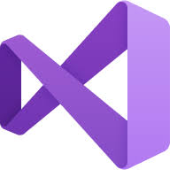
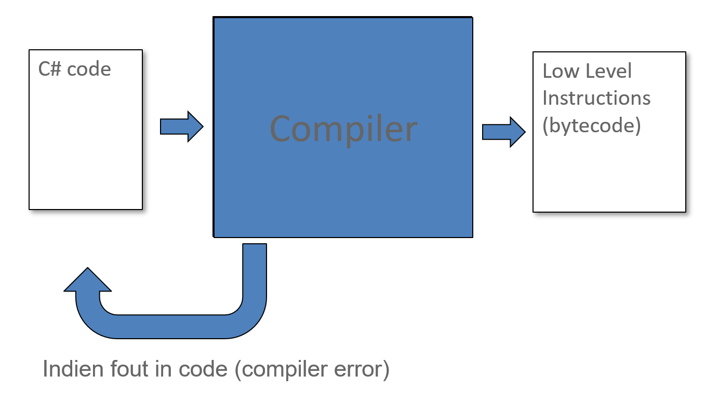
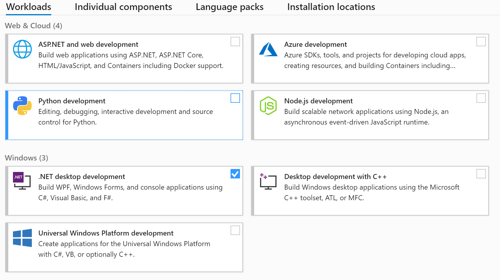
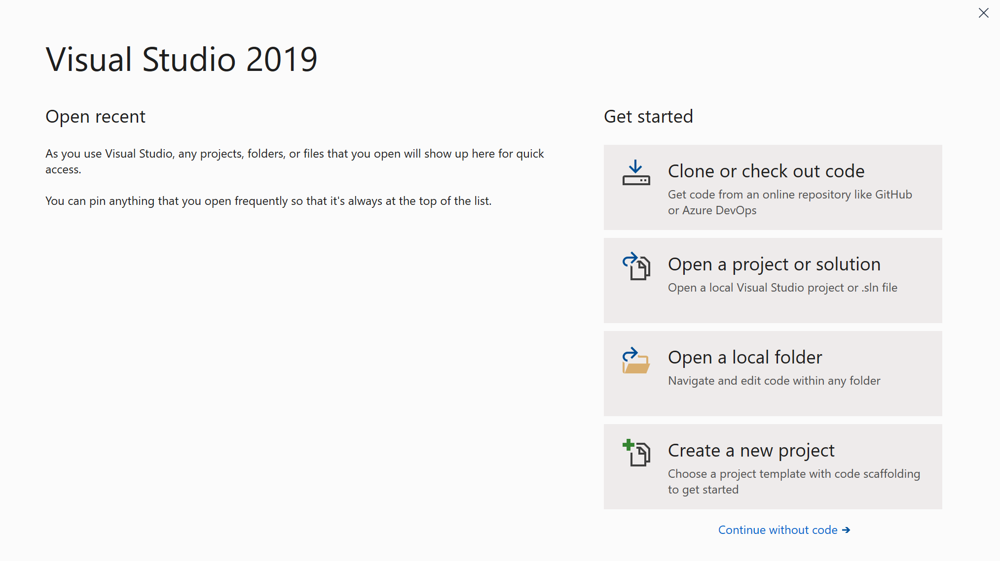
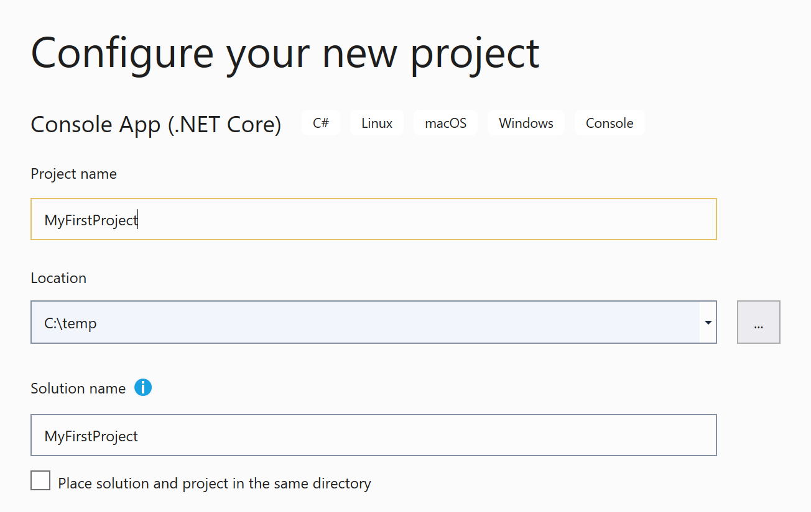
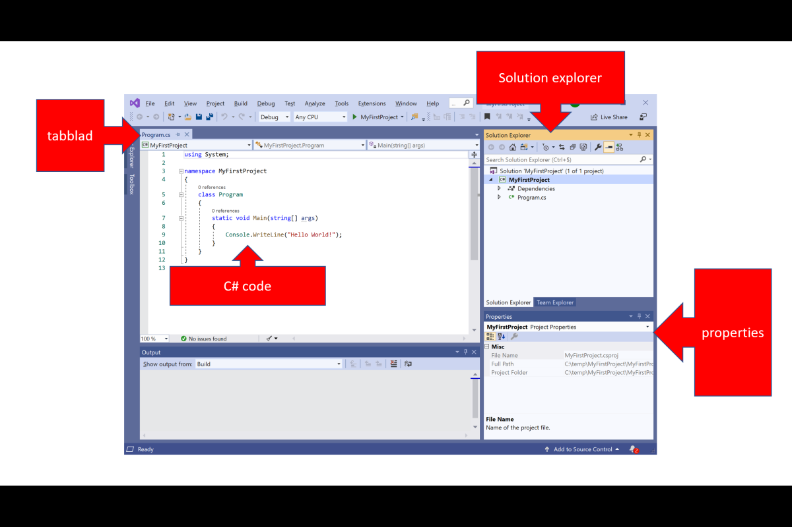
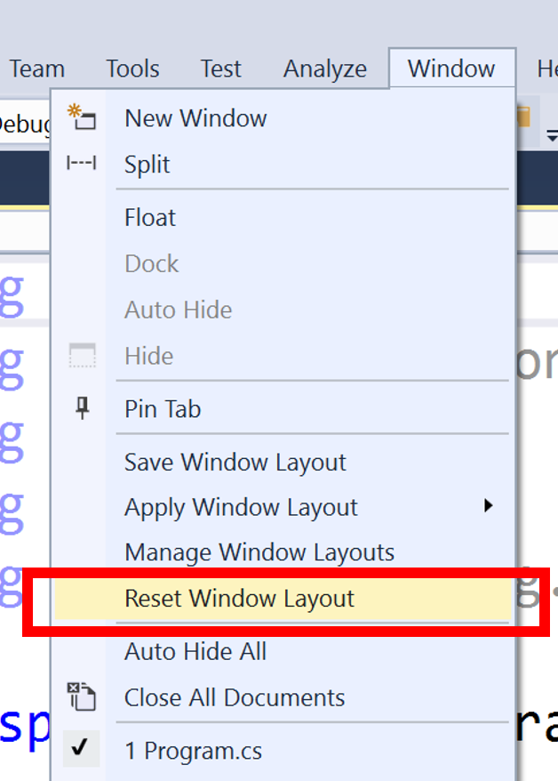

# Kennismaken met C# en Visual Studio

Visual Studio (VS) is een pakket dat een groot deel tools samenvoegt (debuger, code editor, compiler, etc) zodat je niet tientallen paketten moet gebruiken om software te schrijven.

Visual Studio is een zogenaamde IDE("Integrated Development Environment") en is op maat gemaakt om C#.NET applicaties te ontwikkelen. Je bent echter verre van verplicht om enkel C# applicaties in VS te ontwikkelen, je kan gerust VB.NET, TypeScript, Python en andere talen gebruiken.

# De compiler en Visual Studio

Jouw taak als programmeur in deze cursus is algoritmes in C# taal uitschrijven. We zouden dit in een eenvoudige tekstverwerker kunnen doen, maar dan maken we het onszelf lastig. Net zoals je tekst in notepad kunt schrijven, is het handiger dit in bijvoorbeeld Word te doen: je krijgt een spellingchecker en allerlei handige extra's. Ook voor het schrijven van computer code is het handiger om een zogenaamde IDE te gebruiken, een omgeving die ons zal helpen foutloze C# code te schrijven.

Het hart van Visual Studio bestaat uit de **compiler** die we hiervoor besproken. De compiler zal je C# code omzetten naar de IL-code  zodat jij (of anderen) je applicatie op een computer (of ander apparaat) kan gebruiken. Zolang de C# niet exact voldoet aan de C# syntax (zie verder) zal de compiler het vertikken een uitvoerbaar bestand voor je te genereren. 

**Opmerking**: In deze cursus zullen we steeds werken met Visual Studio. Niet met Visual Studio Code. Visual Studio code is een zogenaamde lightweight versie van VS die echter zeker ook z'n voordelen heeft (gratis, snel, compact, etc). Visual Studio vindt dankzij VS Code eindelijk ook z'n weg op andere platformen dan enkel die van Microsoft. Zoek je een lightweight versie dan moet je zeker eens [Visual Studio Code](https://code.visualstudio.com/) eens proberen.

# Visual Studio Installeren

In deze cursus zullen de voorbeelden steeds met de **Enterprise** editie van VS gemaakt zijn. Je kan deze als AP-student gratis downloaden en installeren  via [visualstudio.microsoft.com](https://visualstudio.microsoft.com/thank-you-downloading-visual-studio/?sku=Enterprise).

Het is belangrijk bij de installatie dat je minimaal 
* de **.NET desktop development** workload selecteert als te installeren tools. 
* bij "Individual components" dien je onder de sectie **code tools** zeker ook de **class designer** en **code map** te installeren (zie de screenshot hieronder welke extra tools ik ook aanbeveel)
* Uiteraard ben je vrij om meerdere zaken te installeren

# Visual studio opstarten

Na het opstarten van VS krijg je het startvenster te zien van waaruit je verschillende dingen kan doen.

## Een nieuw project aanmaken

We zullen nu een nieuw project aanmaken, kies hiervoor "Create a new project".

> Het "New Project" venster dat nu verschijnt geeft je hopelijk al een glimp van de veelzijdigheid van VS. In het rechterdeel zie je bijvoorbeeld alle Project Types staan. M.a.w. dit zijn alle soorten programma’s die je kan maken in VS. Naargelang de geïnstalleerde opties en bibliotheken zal deze lijst groter of kleiner zijn.

Dit semester kiezen we steeds als Project Type  **Console App (.NET Core)**. Kies dit type en klik 'Next'.

 Op het volgende scherm kan je een naam geven voor je project alsook de locatie op de harde schijf waar het project dient opgeslagen te worden. **Onthoudt waar je je project aanmaakt zodat je dit later terugvindt**.

**De solution name blijf je af (deze moet momenteel dezelfde naam zijn als je project)**

 > Geef je projectnamen ogenblikkelijk duidelijke namen zodat je niet opgezadeld geraakt met projecten zoals Project201.

Geef je project de naam "MyFirstProject" en kies een goede locatie (ik raad je aan dit steeds in Dropbox of Onedrive te doen)

**Klik nu op create**.

VS heeft nu reeds een aantal bestanden aangemaakt die je nodig hebt om een ‘Console Applicatie’ te maken. 
Een console applicatie is een programma dat alle uitvoer naar een zogenaamde ‘console’ stuurt, een shell. Maw, je kan enkel tekst (Unicode) als uitvoer genereren en dus geen multimedia elementen zoals afbeeldingen, geluid, etc.

# Registreren (eenmalig)

**Volgende stap dien je maar 1 maal te doen indien je VS ergens nieuw hebt geïnstalleerd: het registeren van de installatie.**

Kies 'sign in' en login met je AP-studenten account (je sxxxxx@student.Ap.be account). Als alles goed gaat is nu je versie geregistreerd.

# IDE Layout

Wanneer je VS opstart zal je mogelijk overweldigd worden door de hoeveelheid menu's, knopjes, schermen etc. Dit is normaal voor een IDE: deze wil zoveel mogelijk mogelijkheden aanbieden aan de gebruiker. Vergelijk dit met Word: afhankelijk van wat je gaat doen gebruikt iedere gebruiker andere zaken van Word. De makers van Word kunnen echter niet bepaalde zaken weglaten, ze moeten net zoveel mogelijk aanbieden.

Laat je niet afschrikken door VS. Het is een imponerend programma, maar je zal er sneller dan je verwacht, je weg in terugvinden!

We zullen nu eerst eens bekijken wat we allemaal zien in VS na het aanmaken van een nieuw programma.

* Je kan meerdere bestanden tegelijkertijd openen in VS. Ieder bestand zal z'n eigen **tab** krijgen. De actieve tab is het bestand wiens inhoud je in het hoofdgedeelte eronder te zien krijgt. Merk op dat enkel open bestanden een tab krijgen.

* De "**solution explorer**" toont alle bestanden en elementen die tot het huidige project behoren. Als we dus later nieuwe bestanden toevoegen dan kan je die hier zien (en openen).

* Het **properties** venster (eigenschappen) is een belangrijk venster. Hier komen alle eigenschappen van het huidige geselecteerde element. Selecteer bijvoorbeeld maar eens Program.cs in de solution explorer en merk op dat er allerlei eigenschappen getoond worden. Onderaan het Properties venster wordt steeds meer informatie getoond over de huidig geselecteerde eigenschap.

## Layout kapot/kwijt/vreemd

De layout van VS kan je volledig naar je hand zetten. Je kan ieder (deel-)venster en tab verzetten, verankeren en zelfs verplaatsen naar een ander bureaublad. Experimenteer hier gerust mee en besef dat je steeds alles kan herstellen. Het gebeurt namelijk al eens dat je layout een beetje om zeep is:

* Om eenvoudig een venster terug te krijgen, bijvoorbeeld het properties window of de solution explorer: klik bovenaan in de menubalk op "View" en kies dan het gewenste venster (soms staat dit in een submenu)
* Je kan ook altijd je layout in z'n geheel **resetten**: ga naar "Window" en kies "Reset window layout".

# Je programma starten

De code die VS voor je heeft gemaakt is reeds een werkend, maar weinig nuttig, programma. Je kan de code compileren en uitvoeren door op de groene driehoek bovenaan te klikken:

Als alles goed gaat krijg je nu "Hello world" te zien en wat extra informatie omtrent het programma dat net werd uitgevoerd:

Veel doet je programma nog niet natuurlijk, dus sluit dit venster maar terug af door een willekeurige toets in te drukken.

# TODO
> In [volgende video](https://ap.cloud.panopto.eu/Panopto/Pages/Viewer.aspx?id=1889dae4-d6cf-4ca3-b959-a91100ceeca9) overloop ik de belangrijkste zaken van dit hoofdstuk.

## Is dit alles?

Nee hoor. Visual Studio is lekker groot. Was bovenstaande uitleg toch niet zo verhelderend als ik hoopte. Bekijk dan volgende korte, maar zeer duidelijke uitleg over Visual Studio en de verschillende onderdelen (klik zeker op de chapters in de linkermenu om verder te lezen): [hier](https://tutorials.visualstudio.com/vs-get-started/intro).
