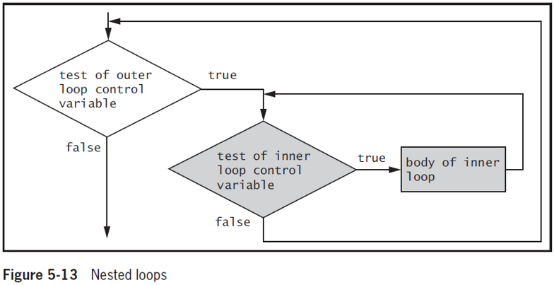
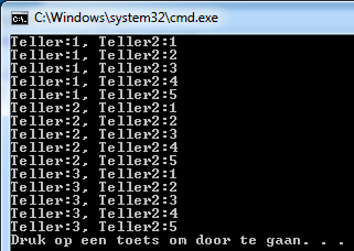

# Nested loops
Wanneer we 1 of meerdere loops in een andere loop plaatsen dan spreken we over **geneste loops**. 
Geneste loops komen vaak voor, maar zijn wel een ras apart wanneer je deze zaken wilt debuggen en correct schrijven.

 


 We spreken steeds over de **outer loop** als de omhullende of "grootste" loop. Waarbij de binnenste loops de **inner loop(s)** zijn. 


 Volgende code toont bijvoorbeeld 2 loops die genest werden:
 ```csharp
int tellerA=0;
int tellerB=0;

while(tellerA<3 )  //outer loop
{
    tellerA++;
    tellerB=0;
    while(tellerB<5)
    {
        tellerB++;
        Console.WriteLine($"Teller:{tellerA}, Teller2:{tellerB}")
    }
}
 ```

 De uitvoer hiervan zal als volgt zijn:

 

**Begrijp je hoe we aan deze uitvoer komen? (tip: analyseer de inner en outer loop apart)**

# Geneste loops tellen
Om te tellen hoe vaak de 'inner' code zal uitgevoerd worden dien je te weten hoe vaak iedere loop afzonderlijk wordt uitgevoerd. Vervolgens vermenenigvuldig je al deze getallen met elkaar.

Een voorbeeld: Hoe vaak zal de zin ``Hallo`` op het scherm verschijnen bij volgende code?
```csharp
for (int i = 0; i < 10; i++)
{
    for (int j = 0; j < 5; j++)
    {
        Console.WriteLine("Hallo");
    }
}

```
De outer loop zal 10 maal uitgevoerd worden (i zal de waarden 0 tot en met 9 krijgen). De inner loop zal 5 maal uitgevoerd worden. In totaal zal dus **50 maal ``Hallo``** op het scherm verschijnen (5x10).

# Break in nested loop
Let er op dat ``break`` je enkel uit de huidge loop zal halen. Indien je dit dus gebruik in de inner loop dan zal de outer loop nog steeds voortgaan. Nog een reden om zéér voorzichtig om te gaan in het gebruik van ``break``.
